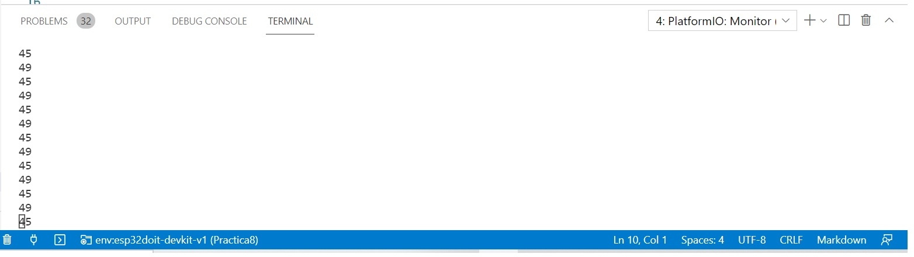
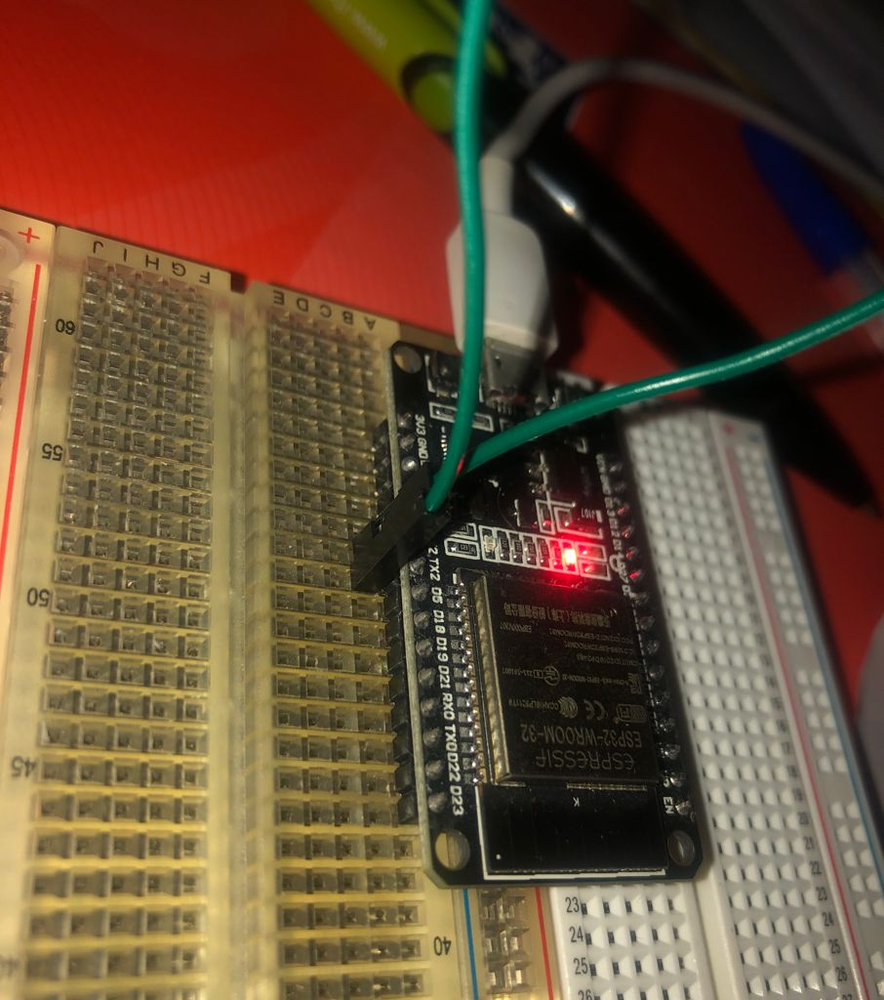

# PRACTICA 8: Buses de comunicación 

## Funcionalidad de la práctica
---------------------------------
>1. Describir la salida por el puerto serie
>2. Explicar el funcionamiento
>3. Salidas y entradas de la consola

>1. 

>Leemos lo que llega con el Serial2 y lo comparamos con el 0. Observaremos 45 y 49. 




>2. 

 
```
#include <Arduino.h>
#define RXD2 16
#define TXD2 17

void setup() {
  // Note the format for setting a serial port is as follows: Serial2.begin(baud-rate, protocol, RX pin, TX pin);
  Serial.begin(115200);
  //Serial1.begin(9600, SERIAL_8N1, RXD2, TXD2);
  Serial2.begin(9600, SERIAL_8N1, RXD2, TXD2);
  Serial.println("Serial Txd is on pin: "+String(TX));
  Serial.println("Serial Rxd is on pin: "+String(RX));
}

void loop() { //Choose Serial1 or Serial2 as required
  while (Serial2.available()) {
      Serial.print(char(Serial2.read()));
                             }
  while (Serial.available()){
    Serial2.print(char(Serial.read()));
}}
```

>Definimos las librerías necesarias: Arduino.h. Y definimos los puertos que necesitaremos. Habrá un receptor, para detectar a señal y otro transmisor, para devolver la señal que queremos.  

```
#include <Arduino.h>
#define RXD2 16
#define TXD2 17
```
Definimos los Serial. Definimos qué puertos necesitaremos. Imprimiremos por pantalla qué recibe en el pin transmisor y el pin receptor. 

```
void setup() {
  // Note the format for setting a serial port is as follows: Serial2.begin(baud-rate, protocol, RX pin, TX pin);
  Serial.begin(115200);
  //Serial1.begin(9600, SERIAL_8N1, RXD2, TXD2);
  Serial2.begin(9600, SERIAL_8N1, RXD2, TXD2);
  Serial.println("Serial Txd is on pin: "+String(TX));
  Serial.println("Serial Rxd is on pin: "+String(RX));
}
```
Creamos un bucle. Mientras el Serial2 esté disponible,  se imprimirá el carácter. 

```
void loop() { //Choose Serial1 or Serial2 as required
  while (Serial2.available()) {
      Serial.print(char(Serial2.read()));
                             }
  while (Serial.available()){
    Serial2.print(char(Serial.read()));
}}
```

>Este simple programa consiste en que solo se ejecute cuando haya un dato disponible en el Serial, es decir, siempre que apretemos una tecla habrá un dato disponible y veremos algo por pantalla.

>Los dos Serial están esperando a que se pulse una tecla. 
Una vez se pulsa la tecla, la información se envía al puerto serie y del puerto serie se vuelven a enviar a la computadora.


>3. Salidas y entradas de la consola

>Conectamos el receptor y el transmisor tal y com observamos en la imagen siguiente: 

